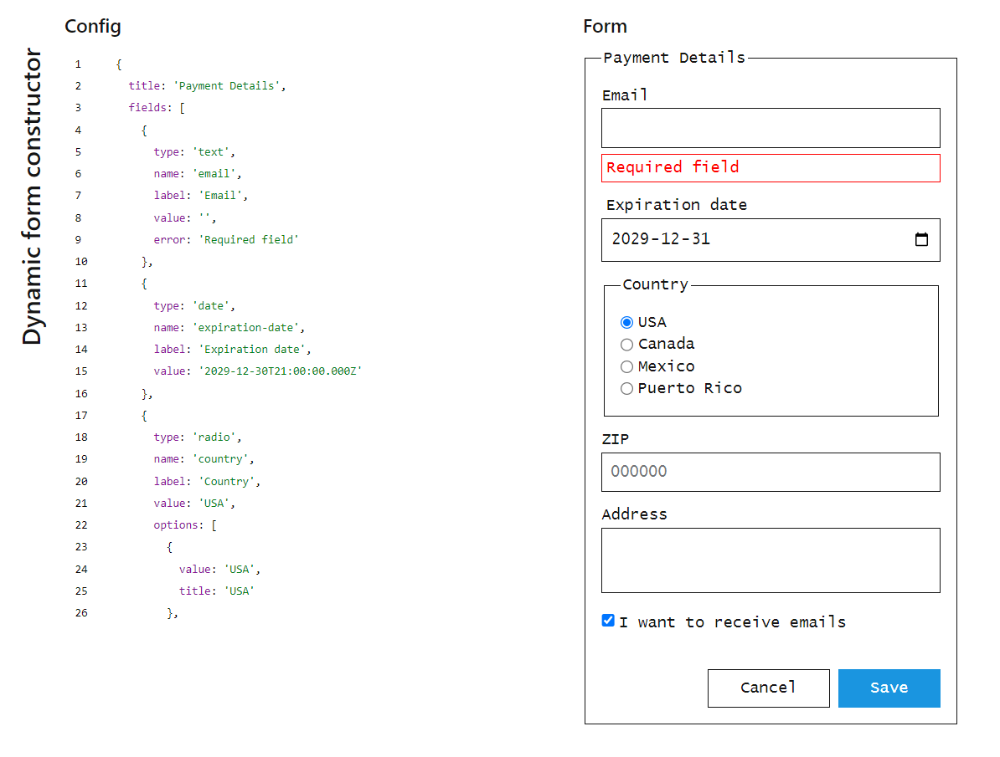

# Dynamic form constructor 👉 [Demo](https://artembert.github.io/dynamic-form-constructor/)

Generate HTML form by using JSON config

## Key features
#### Validate JSON
  
Online JSON editor checks for syntax mistakes and provides human-readable feedback

#### Show plugs instead of wrong configured form fields
  
Form generator renders the error message and config
of wrong field

#### Memoize components to prevent excess rerender
  
Only changed fields will be rerendered when you change the config

### Configurable options
- title: `string`
- fields: [➡️supported configs](./src/types/input-fields.ts)
- action buttons: [➡️supported configs](./src/types/controls.ts)

### Supported field types
- Text
- Number
- Textarea
- Date
- Checkbox
- Radio

### Supported action buttons
- `button`
- `submit`
- `reset`

## License
[MIT License](https://artembert.github.io/dynamic-form-constructor/main/LICENSE) (c) [Artem Beresnev](https://twitter.com/artembert)
